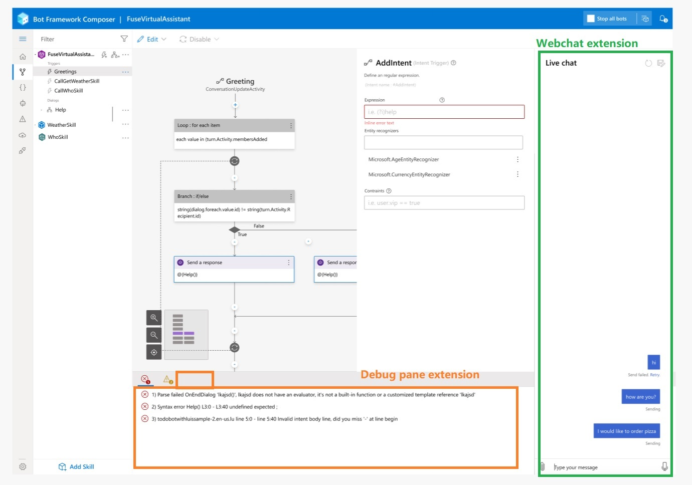
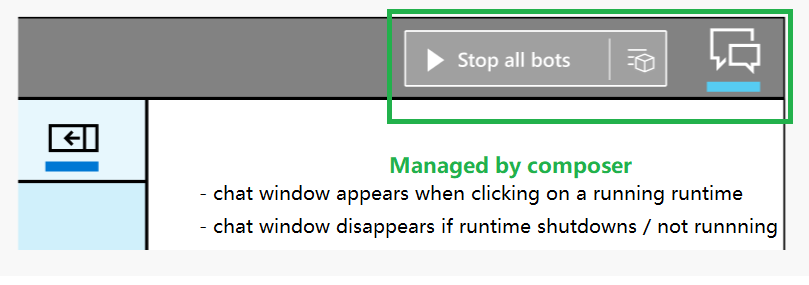
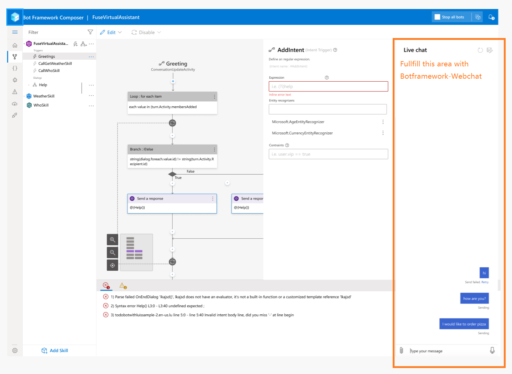

# Webchat as Composer Extension

## Scopes
Webchat extension is consists of 3 small extensions:
1. `node/directline`: A mock DirectLine service to chat with local bot runtime
2. `ui/webchat`: A chat window powered by bf-webchat to let user input messages / update images ...
3. `ui/debugging`: A debug pane extension to implement the 'Emulator logs'

## Structure
```
/extensions
  /...
  /webchat
    /node
      /directline
    /ui
      /webchat
      /debugging
  /pvaPublish
  /...
```

## Functionalities & Interfaces
- `node/directline` appends new web routes to Composer server by invoking
  ```ts
  composer.addWebRoute('post', '/directline/service', (req, res) => {
    res.send('...');
  });
  ```
- `ui/webchat` implements a `<Webchat />` component and register itself in composer extension context by invoking
  ```tsx
  const Webchat = () => {
    const { locale } = useShellData();

    useEffect(() => {
      WebChat.renderWebChat(
        {
          directLine: window.WebChat.createDirectLine({
            token: 'YOUR_DIRECT_LINE_TOKEN'
          }),
          userID: 'YOUR_USER_ID',
          username: 'Web Chat User',
          locale: locale
        },
        document.getElementById('webchat')
      );
    });
    return <div id="webchat"></div>;
  };

  //not implemented yet
  composer.addWebchat(component=Webchat);
  ```
- `ui/debugging` implements a `<EmulatorLogs />` component and register itself in composer extension context by invoking
  ```tsx
  const EmulatorLogs = () => <div>...</div>
  composer.addDebugPane(tabName='Emulator logs', tabIndex=1, component=EmulatorLogs)
  ```

## UI Integration
Generally, Composer will grant 2 areas on the page for webchat extension to contribute.
1. Webchat area on the right pane
2. Debug window on the bottom pane



Note that
- Composer holds a part of the webchat logic including

  - click where to activate webchat
  - responsive layout with/without webchat
  - provide available bot runtime url
  - necessary shell state / API
  - pop-out / pop-in
- On the other hand, Composer doesn't hold
  - how webchat window is rendered, colors and themes
  - how chat message is posted / received
  - user id / user name / conversation id
  - how to restart conversation / save transcript

  Webchat extension holds these items instead.

In brief,
- Composer decides **where** and **when** to show the webchat area;
  
- Webchat ext decies **how** and **what** to show in the webchat window.
  
